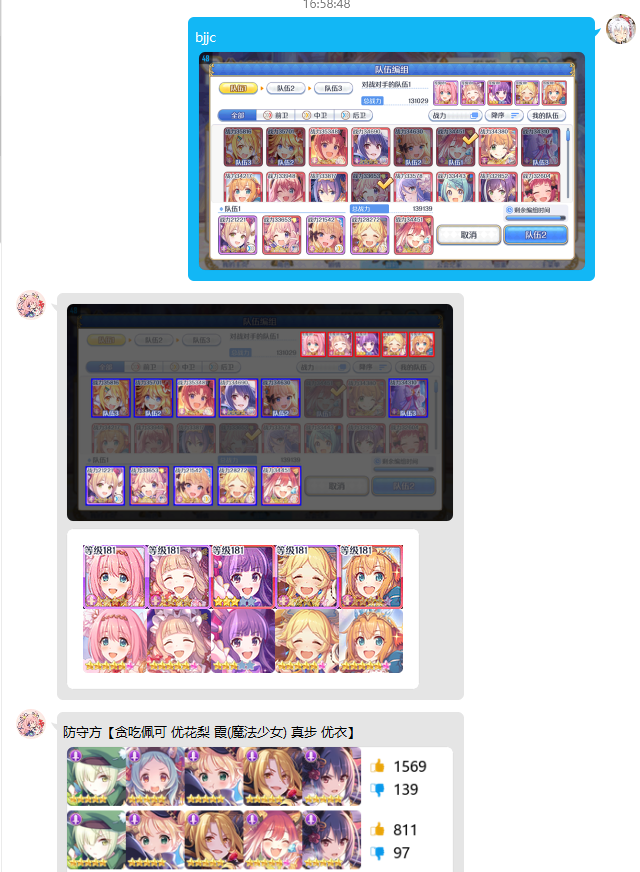

# 竞技场查询 with 图片支持
本模块由[ellye](https://github.com/watermellye)完善功能，增加作业网的截图查询功能。

支持全屏和部分截图。支持从各中页面和长宽比中识别出角色头像。当截图中含有多队时返回无冲配队。

## 食用方法
用本repo将hoshino/modules/priconne/arena替换即可。

指令：b/r/tjjc + 防守队伍文字/防守队伍截图 （无须+号）

使用例见images文件夹或下方。

## 注意

**请确保pillow版本在9.0.0以上**

**增加对新版Hoshino（异步）的支持。若插件不返回图片，请将```render_atk_def_teams()```函数中的```c.render_icon()```前的```await```删除**

由于api存在次数和频率限制，请勿出于好奇进行过多尝试。

若使用多队查询，为确保识别准确，请直接发送完整截图。

本插件能识别的角色根据您的chara列表和res中的角色图标决定。每天会定时同步一次。您也可以通过指令```竞技场更新卡池```来手动同步。

> jjc 使用方法
> 
> 

> 部分截图
> 
> 


> pjjc 预览界面
> 
> 

> pjjc 多队查询
> 
> 

> 近似解查询
>
> 

> 各种情况混搭
>
> 

————以下为原README————

本模块基于 0皆无0（NGA uid=60429400）dalao的[PCR姬器人：可可萝·Android](https://bbs.nga.cn/read.php?tid=18434108)，移植至nonebot框架而成。

重构 by IceCoffee

源代码的使用已获原作者授权。
